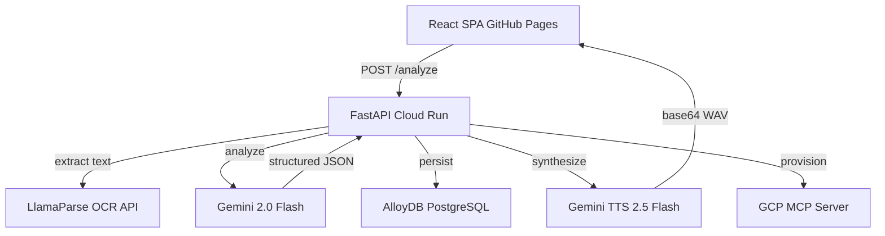

# 🧠 AI-Powered Client Requirement Summarizer
### Upgraded Stack: Kiro + GCP MCP + LlamaIndex OCR + Gemini AI + Voice Assistant (Gemini TTS)

---

## Quick Start

1. Clone the repo and install backend deps: `pip install -r backend/requirements.txt`
2. Copy `backend/.env.example` to `backend/.env` and fill in the values
3. Run `backend/schema.sql` against your AlloyDB instance
4. Start the backend: `uvicorn main:app --reload --port 8000`
5. In a second terminal: `cd frontend && npm install && npm run dev`

---

## Architecture



---

## 🗺️ Architecture Overview

```
[React Frontend — Kiro Generated]
        ↓  HTTPS API calls
[Google Cloud Run — FastAPI Backend]
        ↓                    ↓                      ↓
[Google Gemini API]     [AlloyDB — PostgreSQL]   [GCP MCP Server]
        ↓                    ├── document_metadata      ↓
[Gemini TTS Voice]           ├── analysis_results   [Cloud Storage]
        ↓                    ├── sessions            [Secret Manager]
[LlamaIndex OCR Engine]      └── audit_logs         [Artifact Registry]
```

---

## 🧰 Updated Tech Stack

| Layer | Original | Upgraded |
|---|---|---|
| **AI IDE** | Manual coding | **Kiro (AI-native IDE)** |
| **AI Engine** | Claude API | **Google Gemini API (gemini-2.0-flash)** |
| **OCR / Document Parsing** | PyPDF2 + python-docx | **LlamaIndex + LlamaParse OCR** |
| **Voice Assistant** | None | **Gemini TTS (gemini-2.5-flash-preview-tts)** |
| **GCP Integration** | Manual SDK calls | **GCP MCP Server** |
| **Database** | AlloyDB | **AlloyDB (unchanged)** |
| **Backend** | FastAPI on Cloud Run | **FastAPI on Cloud Run (unchanged)** |
| **Frontend** | HTML/JS on GitHub Pages | **React (Kiro-generated) on GitHub Pages** |
| **CI/CD** | GitHub Actions | **GitHub Actions (unchanged)** |

---

## 📁 Updated Project Structure

```
ai-req-summarizer/
├── .kiro/
│   ├── specs/
│   │   ├── requirement-summarizer.md      # Kiro spec (feature definition)
│   │   └── voice-assistant.md             # Kiro spec (voice feature)
│   └── steering/
│       └── project.md                     # Kiro project-level steering
│
├── backend/
│   ├── main.py                            # FastAPI app
│   ├── ocr_engine.py                      # LlamaIndex OCR + LlamaParse
│   ├── gemini_engine.py                   # Gemini AI analysis calls
│   ├── voice_engine.py                    # Gemini TTS voice synthesis
│   ├── database.py                        # AlloyDB async connection
│   ├── models.py                          # SQLAlchemy ORM models
│   ├── gcp_mcp_client.py                  # GCP MCP server integration
│   ├── requirements.txt
│   └── Dockerfile
│
├── frontend/                              # React app (Kiro-generated)
│   ├── src/
│   │   ├── App.jsx
│   │   ├── components/
│   │   │   ├── FileUploader.jsx
│   │   │   ├── ResultsTabs.jsx
│   │   │   ├── VoicePlayer.jsx            # Gemini TTS playback UI
│   │   │   └── GapFlags.jsx
│   │   └── api/
│   │       └── client.js
│   └── package.json
│
├── mcp/
│   └── gcp-mcp-server/                   # GCP MCP server config
│       └── mcp_config.json
│
├── .github/
│   └── workflows/
│       └── deploy.yml
└── README.md
```

---

## 🔑 API Keys & Secrets Required

| Secret Name | Service | Where Stored |
|---|---|---|
| `GOOGLE_AI_API_KEY` | Gemini API (analysis + TTS) | GCP Secret Manager |
| `LLAMA_CLOUD_API_KEY` | LlamaParse OCR | GCP Secret Manager |
| `DB_PASS` | AlloyDB | GCP Secret Manager |
| `ALLOYDB_INSTANCE_URI` | AlloyDB | Cloud Run env |
| `GCP_PROJECT_ID` | All GCP services | Cloud Run env |

---

## 🗄️ Phase 0 — GCP MCP Server Setup

The GCP MCP server lets Kiro (and your backend) interact with Google Cloud services directly via natural language commands in the IDE.

### Install GCP MCP Server

```bash
# Install the GCP MCP server globally
npm install -g @modelcontextprotocol/server-gcp

# Authenticate to GCP
gcloud auth application-default login

# Configure MCP for Kiro (add to .kiro/mcp_config.json)
```

**`.kiro/mcp_config.json`:**
```json
{
  "mcpServers": {
    "gcp": {
      "command": "npx",
      "args": ["-y", "@modelcontextprotocol/server-gcp"],
      "env": {
        "GOOGLE_CLOUD_PROJECT": "YOUR_PROJECT_ID",
        "GOOGLE_APPLICATION_CREDENTIALS": "~/.config/gcloud/application_default_credentials.json"
      }
    }
  }
}
```

Once configured, you can ask Kiro directly:
> "Create an AlloyDB cluster in asia-south1" or "Deploy the backend to Cloud Run"

---

## 🗄️ Phase 1 — AlloyDB Setup (via GCP MCP or CLI)

```bash
gcloud config set project YOUR_PROJECT_ID

gcloud services enable alloydb.googleapis.com \
  servicenetworking.googleapis.com \
  aiplatform.googleapis.com \
  texttospeech.googleapis.com \
  secretmanager.googleapis.com

gcloud alloydb clusters create req-summarizer-cluster \
  --region=asia-south1 \
  --password=YOUR_DB_PASSWORD

gcloud alloydb instances create req-summarizer-primary \
  --instance-type=PRIMARY \
  --cpu-count=2 \
  --region=asia-south1 \
  --cluster=req-summarizer-cluster
```

**Database schema remains the same** — run the SQL from your original guide to create:
- `sessions` table
- `document_metadata` table  
- `analysis_results` table
- `audit_logs` table

---

## ⚙️ Phase 2 — Backend (FastAPI on Cloud Run)

### Updated `requirements.txt`

```
fastapi==0.111.0
uvicorn==0.30.0
google-generativeai==0.7.0          # Gemini AI + TTS
llama-index==0.10.0                 # LlamaIndex core
llama-parse==0.4.0                  # LlamaParse OCR
llama-index-readers-file==0.1.0    # File readers
asyncpg==0.29.0
sqlalchemy[asyncio]==2.0.30
google-cloud-alloydb-connector[asyncpg]==1.0.0
google-cloud-secret-manager==2.20.0
python-multipart==0.0.9
python-dotenv==1.0.1
pydantic==2.7.0
aiofiles==23.2.1
```

---

### `ocr_engine.py` — LlamaIndex OCR

```python
import os
import tempfile
import aiofiles
from llama_parse import LlamaParse
from llama_index.core import SimpleDirectoryReader

LLAMA_API_KEY = os.getenv("LLAMA_CLOUD_API_KEY")

# LlamaParse handles scanned PDFs, complex layouts, tables
parser = LlamaParse(
    api_key=LLAMA_API_KEY,
    result_type="markdown",          # Returns clean markdown from OCR
    num_workers=2,
    verbose=False,
    language="en",
)

file_extractor = {
    ".pdf": parser,
    ".docx": parser,
    ".doc": parser,
    ".png": parser,
    ".jpg": parser,
    ".jpeg": parser,
    ".tiff": parser,
}

async def extract_text_llamaindex(file_bytes: bytes, filename: str) -> dict:
    """
    Use LlamaIndex + LlamaParse to extract text from any document,
    including scanned PDFs and image-based files.
    """
    ext = "." + filename.lower().split(".")[-1]

    # Write temp file for LlamaIndex to read
    with tempfile.NamedTemporaryFile(suffix=ext, delete=False) as tmp:
        tmp.write(file_bytes)
        tmp_path = tmp.name

    try:
        reader = SimpleDirectoryReader(
            input_files=[tmp_path],
            file_extractor=file_extractor,
        )
        documents = reader.load_data()
        full_text = "\n\n".join([doc.text for doc in documents])
        page_count = len(documents)
    finally:
        os.unlink(tmp_path)

    return {
        "text": full_text.strip(),
        "page_count": page_count,
        "file_type": ext.lstrip("."),
        "char_count": len(full_text),
        "ocr_engine": "LlamaIndex + LlamaParse",
    }
```

---

### `gemini_engine.py` — Gemini AI Analysis

```python
import google.generativeai as genai
import json
import os
import time

genai.configure(api_key=os.getenv("GOOGLE_AI_API_KEY"))

SYSTEM_INSTRUCTION = """You are an expert Business Analyst assistant.
Your job is to analyze client requirement documents (BRDs, SoWs) and produce
structured, actionable outputs for development teams.
Always return valid JSON only — no extra text, no markdown, no code fences."""

model = genai.GenerativeModel(
    model_name="gemini-2.0-flash",
    system_instruction=SYSTEM_INSTRUCTION,
)

def analyze_document_gemini(document_text: str) -> dict:
    """Send document to Gemini and return structured analysis."""

    max_chars = 150000
    if len(document_text) > max_chars:
        document_text = document_text[:max_chars] + "\n\n[Document truncated]"

    prompt = f"""Analyze the following requirement document and return a JSON object with exactly these keys:

{{
  "executive_summary": "3-5 sentence overview of scope, objectives, stakeholders, timeline",
  "user_stories": [
    {{
      "id": "US-001",
      "role": "customer",
      "feature": "reset my password via OTP",
      "benefit": "regain account access securely",
      "priority": "High"
    }}
  ],
  "acceptance_criteria": [
    {{
      "story_id": "US-001",
      "given": "the user enters a valid OTP",
      "when": "they click verify",
      "then": "they are redirected to the dashboard"
    }}
  ],
  "gap_flags": [
    {{
      "type": "Missing",
      "description": "No mention of error handling for expired OTP",
      "severity": "Medium"
    }}
  ]
}}

Document:
{document_text}"""

    start = time.time()

    response = model.generate_content(prompt)
    elapsed_ms = int((time.time() - start) * 1000)

    raw = response.text.strip()
    # Strip markdown fences if Gemini adds them
    if raw.startswith("```"):
        raw = raw.split("```")[1]
        if raw.startswith("json"):
            raw = raw[4:]

    try:
        result = json.loads(raw)
    except json.JSONDecodeError:
        result = {
            "executive_summary": raw,
            "user_stories": [],
            "acceptance_criteria": [],
            "gap_flags": [{"type": "Error", "description": "JSON parse failed", "severity": "High"}],
        }

    return {
        "result": result,
        "tokens_used": response.usage_metadata.total_token_count,
        "processing_time_ms": elapsed_ms,
        "model_used": "gemini-2.0-flash",
    }
```

---

### `voice_engine.py` — Gemini TTS Voice Assistant

```python
import google.generativeai as genai
import os
import base64

genai.configure(api_key=os.getenv("GOOGLE_AI_API_KEY"))

tts_client = genai.Client()

def summarize_to_speech(analysis_result: dict) -> str:
    """
    Convert the executive summary into spoken audio using Gemini TTS.
    Returns base64-encoded WAV audio string.
    """
    summary = analysis_result.get("executive_summary", "No summary available.")
    story_count = len(analysis_result.get("user_stories", []))
    gap_count = len(analysis_result.get("gap_flags", []))

    # Build a concise voice-friendly script
    voice_script = f"""
    Analysis complete. Here is your requirement summary.
    {summary}
    The document contains {story_count} user stories and {gap_count} gap flags identified.
    Please review the full breakdown in the results panel.
    """

    response = tts_client.models.generate_content(
        model="gemini-2.5-flash-preview-tts",
        contents=voice_script,
        config=genai.types.GenerateContentConfig(
            response_modalities=["AUDIO"],
            speech_config=genai.types.SpeechConfig(
                voice_config=genai.types.VoiceConfig(
                    prebuilt_voice_config=genai.types.PrebuiltVoiceConfig(
                        voice_name="Aoede",   # Natural, professional voice
                    )
                )
            ),
        ),
    )

    audio_data = response.candidates[0].content.parts[0].inline_data.data
    return base64.b64encode(audio_data).decode("utf-8")


def text_to_speech_custom(text: str, voice: str = "Aoede") -> str:
    """
    Convert any text to speech. Useful for reading individual user stories aloud.
    Available voices: Aoede, Charon, Fenrir, Kore, Puck
    """
    response = tts_client.models.generate_content(
        model="gemini-2.5-flash-preview-tts",
        contents=text,
        config=genai.types.GenerateContentConfig(
            response_modalities=["AUDIO"],
            speech_config=genai.types.SpeechConfig(
                voice_config=genai.types.VoiceConfig(
                    prebuilt_voice_config=genai.types.PrebuiltVoiceConfig(
                        voice_name=voice,
                    )
                )
            ),
        ),
    )

    audio_data = response.candidates[0].content.parts[0].inline_data.data
    return base64.b64encode(audio_data).decode("utf-8")
```

---

### Updated `main.py` — Key Changes

```python
# Replace parse_document import with:
from ocr_engine import extract_text_llamaindex
from gemini_engine import analyze_document_gemini
from voice_engine import summarize_to_speech

# In /analyze endpoint, replace:
# parsed = parse_document(file_bytes, file.filename)
# With:
parsed = await extract_text_llamaindex(file_bytes, file.filename)

# Replace analyze_document() call with:
analysis = analyze_document_gemini(parsed["text"])

# Add new /voice endpoint:
@app.post("/voice-summary")
async def get_voice_summary(request: Request):
    body = await request.json()
    analysis_result = body.get("result", {})
    audio_b64 = summarize_to_speech(analysis_result)
    return {"audio_base64": audio_b64, "format": "wav"}

# Add endpoint to read a single user story aloud:
@app.post("/voice-story")
async def read_story(request: Request):
    body = await request.json()
    story = body.get("story", {})
    text = f"User story {story.get('id')}: As a {story.get('role')}, I want to {story.get('feature')}, so that {story.get('benefit')}. Priority: {story.get('priority')}."
    voice = body.get("voice", "Aoede")
    audio_b64 = text_to_speech_custom(text, voice)
    return {"audio_base64": audio_b64, "format": "wav"}
```

---

## 🖥️ Phase 3 — Frontend (React, Kiro-Generated)

The frontend is generated and maintained by **Kiro** from your spec files. Key new components:

### `VoicePlayer.jsx`
```jsx
import { useState } from "react";

export default function VoicePlayer({ apiBase, analysisResult }) {
  const [playing, setPlaying] = useState(false);
  const [loading, setLoading] = useState(false);

  const playSummary = async () => {
    setLoading(true);
    try {
      const res = await fetch(`${apiBase}/voice-summary`, {
        method: "POST",
        headers: { "Content-Type": "application/json" },
        body: JSON.stringify({ result: analysisResult }),
      });
      const data = await res.json();

      // Decode base64 WAV and play
      const binary = atob(data.audio_base64);
      const bytes = new Uint8Array(binary.length);
      for (let i = 0; i < binary.length; i++) bytes[i] = binary.charCodeAt(i);
      const blob = new Blob([bytes], { type: "audio/wav" });
      const url = URL.createObjectURL(blob);
      const audio = new Audio(url);
      setPlaying(true);
      audio.play();
      audio.onended = () => setPlaying(false);
    } catch (err) {
      console.error("TTS error:", err);
    } finally {
      setLoading(false);
    }
  };

  return (
    <button onClick={playSummary} disabled={loading || playing} className="btn-voice">
      {loading ? "⏳ Generating audio..." : playing ? "🔊 Playing..." : "🎙️ Listen to Summary"}
    </button>
  );
}
```

---

## 🧪 Running Tests

```bash
# Unit tests only
pytest backend/tests/ -v --tb=short -k "not e2e and not properties"

# Property tests only
pytest backend/tests/test_e2e_properties.py -v --tb=short

# Integration tests only
pytest backend/tests/test_e2e_integration.py -v --tb=short

# Full suite with coverage report
pytest backend/tests/ -v --tb=short --cov=backend --cov-report=term
```

---

## ✅ Phase 6 — Final Checklist (Updated)

- [ ] GCP MCP server configured in `.kiro/mcp_config.json`
- [ ] Kiro specs created and approved (see Kiro Specs Guide)
- [ ] `GOOGLE_AI_API_KEY` stored in GCP Secret Manager
- [ ] `LLAMA_CLOUD_API_KEY` stored in GCP Secret Manager
- [ ] AlloyDB cluster running and schema created
- [ ] LlamaIndex OCR tested on a scanned PDF
- [ ] Gemini analysis returns valid JSON
- [ ] Gemini TTS `/voice-summary` returns playable audio
- [ ] Voice player plays in browser without errors
- [ ] Backend deployed to Cloud Run
- [ ] React frontend deployed to GitHub Pages
- [ ] CI/CD pipeline triggers on push to `main`

---

## 💰 Cost Estimate (Monthly — Demo Scale)

| Service | Cost |
|---|---|
| Cloud Run (low traffic) | ~$0–5 |
| AlloyDB (smallest instance) | ~$70–100 |
| Gemini API (analysis) | ~$1–5 per 100 docs |
| Gemini TTS | ~$0.50–2 per 100 docs |
| LlamaParse OCR | ~$3 per 1000 pages (free tier: 1000 pages/day) |
| Artifact Registry | ~$1 |
| **Total** | **~$75–115/month** |

> 💡 LlamaParse free tier covers most demo usage. Pause AlloyDB when not presenting to save ~$3/day.

---

## 🔑 Environment Variables Reference

| Variable | Where | Value |
|---|---|---|
| `GOOGLE_AI_API_KEY` | Secret Manager | Your Gemini API key (Google AI Studio) |
| `LLAMA_CLOUD_API_KEY` | Secret Manager | Your LlamaCloud API key |
| `DB_PASS` | Secret Manager | AlloyDB password |
| `DB_USER` | Cloud Run env | `postgres` |
| `DB_NAME` | Cloud Run env | `req_summarizer` |
| `ALLOYDB_INSTANCE_URI` | Cloud Run env | Full AlloyDB instance path |
| `GCP_PROJECT_ID` | Cloud Run env | Your GCP project ID |
| `API_BASE` | Frontend env | Your Cloud Run URL |

---

*Upgraded for Cognizant Innovation Challenge | Gen AI Theme*
*Stack: Gemini API + LlamaIndex OCR + Gemini TTS + AlloyDB + Cloud Run + Kiro + GCP MCP*

---

## 🔐 GitHub Secrets Setup

Before the CI/CD pipelines can run, add the following secrets to your GitHub repository under **Settings → Secrets and variables → Actions → New repository secret**.

| Secret Name | Description |
|---|---|
| `GCP_SA_KEY` | GCP service account JSON key (base64 or raw JSON). The service account must have **Cloud Run Admin** and **Artifact Registry Writer** roles. |
| `GCP_PROJECT_ID` | Your GCP project ID (e.g. `my-project-123`). |
| `ALLOYDB_INSTANCE_URI` | Full AlloyDB connector URI in the format `projects/PROJECT/locations/REGION/clusters/CLUSTER/instances/INSTANCE`. |
| `CLOUD_RUN_URL` | The Cloud Run service URL (e.g. `https://backend-xxxx-uc.a.run.app`). Set this after the first manual deploy. |

### Create the Service Account with Minimum Required Roles

```bash
# Set your project
export PROJECT_ID="YOUR_PROJECT_ID"

# Create the service account
gcloud iam service-accounts create github-actions-deployer \
  --display-name="GitHub Actions Deployer" \
  --project="${PROJECT_ID}"

# Grant Cloud Run Admin role
gcloud projects add-iam-policy-binding "${PROJECT_ID}" \
  --member="serviceAccount:github-actions-deployer@${PROJECT_ID}.iam.gserviceaccount.com" \
  --role="roles/run.admin"

# Grant Artifact Registry Writer role
gcloud projects add-iam-policy-binding "${PROJECT_ID}" \
  --member="serviceAccount:github-actions-deployer@${PROJECT_ID}.iam.gserviceaccount.com" \
  --role="roles/artifactregistry.writer"

# Grant Service Account User role (required to deploy to Cloud Run)
gcloud projects add-iam-policy-binding "${PROJECT_ID}" \
  --member="serviceAccount:github-actions-deployer@${PROJECT_ID}.iam.gserviceaccount.com" \
  --role="roles/iam.serviceAccountUser"

# Generate and download the JSON key
gcloud iam service-accounts keys create github-actions-key.json \
  --iam-account="github-actions-deployer@${PROJECT_ID}.iam.gserviceaccount.com"

# Copy the contents of github-actions-key.json into the GCP_SA_KEY GitHub secret
cat github-actions-key.json
```

> ⚠️ Delete `github-actions-key.json` from your local machine after adding it to GitHub Secrets.
